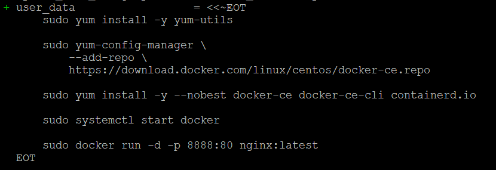

# AlicloudExperiment

Need to run dockerscript.sh manually to install docker engine and run nginx.

Even in terraform plan, its show the script one by one but not execute it.

After that the access it via SLB IP or ECS public IP with port 8888.
